# Javascript.info Notes

My notes from the [javascript.info](https://javascript.info) website.

# **Table of Contents**

- [Javascript.info Notes](#javascriptinfo-notes)
- [**Table of Contents**](#table-of-contents)
- [**Objects**](#objects)
  - [**Object references and copying**](#object-references-and-copying)
  - [**Garbage Collection**](#garbage-collection)
  - [**Object methods, this**](#object-methods-this)
  - [**Constructor, operator "new"**](#constructor-operator-new)
  - [**Optional chaining '?.'**](#optional-chaining-)
  - [**Summary**](#summary)
  - [**Symbol Type**](#symbol-type)
  - [**Object to primitive conversion**](#object-to-primitive-conversion)
  - [**ToPrimitive**](#toprimitive)
- [**Data types**](#data-types)
  - [**Primative Methods**](#primative-methods)
  - [**Numbers**](#numbers)
  - [**toString(base)**](#tostringbase)
  - [**Rounding**](#rounding)
  - [**Imprecise Calculations**](#imprecise-calculations)
  - [**parseInt and parseFloat**](#parseint-and-parsefloat)
  - [**Other math functions**](#other-math-functions)
  - [**Strings**](#strings)
  - [**Special Characters**](#special-characters)
  - [**Accessing characters**](#accessing-characters)
  - [**Strings are immutable**](#strings-are-immutable)
  - [**Searching for a substring**](#searching-for-a-substring)
  - [**The bitwise NOT trick**](#the-bitwise-not-trick)
  - [**Searching in array**](#searching-in-array)
    - [**includes, startsWith, endsWith**](#includes-startswith-endswith)
    - [**Getting a substring**](#getting-a-substring)
  - [**Comparing strings**](#comparing-strings)
  - [**Summary**](#summary-1)
  - [**Arrays**](#arrays)
  - [**A word about "length"**](#a-word-about-length)
  - [**Array methods**](#array-methods)
  - [**splice**](#splice)
  - [**slice**](#slice)
  - [**concat**](#concat)
  - [**forEach**](#foreach)
  - [**Searching in array**](#searching-in-array-1)
    - [**`indexOf`/`lastIndexOf` and includes**](#indexoflastindexof-and-includes)
    - [**`find` and `findIndex`\*\*](#find-and-findindex)
    - [**`filter`**](#filter)
  - [**Transform an array**](#transform-an-array)
    - [**`map`**](#map)
    - [**`sort(fn)`**](#sortfn)
    - [**`reverse`**](#reverse)
    - [**`split` and `join`**](#split-and-join)
    - [**`reduce`/`reduceRight`**](#reducereduceright)
    - [**`Array.isArray(value)`**](#arrayisarrayvalue)
    - [**Most methods support "thisArg"**](#most-methods-support-thisarg)
  - [**Iterables**](#iterables)
    - [**Array-likes**](#array-likes)
    - [**Array.from**](#arrayfrom)
  - [**Map and Set**](#map-and-set)
    - [**Map**](#map-1)
      - [**How Map compares keys**](#how-map-compares-keys)
      - [**Chaining**](#chaining)
    - [**Iteration over Map**](#iteration-over-map)
    - [**Object.entries: Map from Object**](#objectentries-map-from-object)
    - [**Object.fromEntries: Object from Map**](#objectfromentries-object-from-map)
    - [**Set**](#set)
  - [**WeakMap and WeakSet**](#weakmap-and-weakset)
    - [**Use case: caching**](#use-case-caching)
  - [**Object.keys, values, entries**](#objectkeys-values-entries)
    - [**Transforming objects**](#transforming-objects)
  - [**Destructuring assignment**](#destructuring-assignment)
    - [**Array Destructuring**](#array-destructuring)
      - [**The rest '...'**](#the-rest-)
      - [**Default values**](#default-values)
    - [**Object destructuring**](#object-destructuring)
      - [**Nested Destructuring**](#nested-destructuring)
      - [**Smart function parameters**](#smart-function-parameters)
    - [**Data and time**](#data-and-time)
      - [**`new Date(milliseconds)`**](#new-datemilliseconds)
      - [**`new Date(datestring)`**](#new-datedatestring)
      - [**`new Date(year, month, date, hours, minutes, seconds, ms)`**](#new-dateyear-month-date-hours-minutes-seconds-ms)
    - [**Access date components**](#access-date-components)
      - [**`getFullYear()`\*\*](#getfullyear)
      - [**`getMonth()`\*\*](#getmonth)
      - [**`getDate()`\*\*](#getdate)
      - [**`getHours()`, `getMinutes()`, `getSeconds()`, `getMilliseconds()`**](#gethours-getminutes-getseconds-getmilliseconds)
      - [**`getDay()`**](#getday)
      - [**`getTime()`**](#gettime)
      - [**`getTimezoneOffset()`**](#gettimezoneoffset)
    - [**Autocorrection**](#autocorrection)
    - [**Date to number, date diff**](#date-to-number-date-diff)
    - [**Date.now()**](#datenow)
    - [**Benchmarking**](#benchmarking)
    - [**`Date.parse` from a string\*\*](#dateparse-from-a-string)
  - [**JSON methods**](#json-methods)
    - [**`JSON.stringify`**](#jsonstringify)
    - [**Excluding and transforming: replacer**](#excluding-and-transforming-replacer)
      - [**value**](#value)
      - [**replacer**](#replacer)
      - [**space**](#space)
    - [**Formatting: space**](#formatting-space)
    - [**Custom “toJSON”**](#custom-tojson)
    - [**`JSON.parse`**](#jsonparse)
      - [**str**](#str)
      - [**reviver**](#reviver)
    - [**Using reviver**](#using-reviver)
  - [**Advanced working with functions**](#advanced-working-with-functions)
    - [**Recursion and Stack**](#recursion-and-stack)
      - [**The execution context and stack**](#the-execution-context-and-stack)
      - [**Recursive traversals**](#recursive-traversals)
      - [**Recursive structures**](#recursive-structures)
      - [**# Linked List**](#-linked-list)
    - [**Rest parameters and spread syntax**](#rest-parameters-and-spread-syntax)
      - [**Rest parameters `...`**](#rest-parameters-)
      - [**The “arguments” variable**](#the-arguments-variable)
      - [**Spread syntax**](#spread-syntax)
      - [**Copy an array/object**](#copy-an-arrayobject)
    - [**Variable scope, closure**](#variable-scope-closure)
      - [**Lexical Environment**](#lexical-environment)
      - [**# 1. Variables**](#-1-variables)
      - [**# 2. Function Declarations**](#-2-function-declarations)
      - [**# 3. Inner and outer LE**](#-3-inner-and-outer-le)
      - [**# 4. Returning a function**](#-4-returning-a-function)
      - [**# Closure**](#-closure)
    - [**Garbage Collection**](#garbage-collection-1)
      - [**Real-life optimizations**](#real-life-optimizations)
  - [**The old "var"**](#the-old-var)
  - [**Global object**](#global-object)
    - [**Using for polyfills**](#using-for-polyfills)
  - [**Function object, NFE**](#function-object-nfe)
    - [**The name property**](#the-name-property)
    - [**The length property**](#the-length-property)
    - [**Custom properties**](#custom-properties)
    - [**Named Fn Expression**](#named-fn-expression)
  - [**The "new Function" syntax**](#the-new-function-syntax)
    - [**Closures**](#closures)
  - [**Scheduling: setTimeout and setInterval**](#scheduling-settimeout-and-setinterval)
    - [**setTimeout**](#settimeout)
      - [**`func|code`**](#funccode)
      - [**`delay`**](#delay)
      - [**`arg1, arg2`...**](#arg1-arg2)
      - [**Pass a fn, but don't run it**](#pass-a-fn-but-dont-run-it)
      - [**`Canceling with clearTimeout`**](#canceling-with-cleartimeout)
    - [**setInterval**](#setinterval)
      - [**Time goes on while `alert` is shown**](#time-goes-on-while-alert-is-shown)
    - [**Nested timeout**](#nested-timeout)
      - [**Garbagte collection and setInterval/setTimeout callback**](#garbagte-collection-and-setintervalsettimeout-callback)
    - [**Zero delay setTimeout**](#zero-delay-settimeout)
      - [**Zero delay is in fact not zero (in a browser)**](#zero-delay-is-in-fact-not-zero-in-a-browser)
  - [**Decorators and forwarding, call/apply**](#decorators-and-forwarding-callapply)
    - [**Transparent caching**](#transparent-caching)
    - [**Using "func.call" for the context**](#using-funccall-for-the-context)
    - [**Going multi-argument**](#going-multi-argument)
      - [**func.apply**](#funcapply)
      - [**Borrowing a method**](#borrowing-a-method)
    - [**Decorators and function properties**](#decorators-and-function-properties)
  - [**Function binding**](#function-binding)
    - [**Losing "this"**](#losing-this)
    - [**Solution 1: a wrapper**](#solution-1-a-wrapper)
    - [**Solution 2: bind**](#solution-2-bind)
      - [**Convenience method: `bindAll`**](#convenience-method-bindall)
    - [**Partial fns**](#partial-fns)
    - [**Going partial without context**](#going-partial-without-context)
  - [**Arrow fns revisited**](#arrow-fns-revisited)
    - [**Arrow fns have no this**](#arrow-fns-have-no-this)
      - [**Arrow fns vs bindk**](#arrow-fns-vs-bindk)
    - [**Arrow have no "arguments"**](#arrow-have-no-arguments)
- [**Object properties configuration**](#object-properties-configuration)
  - [**Property flags and descriptors**](#property-flags-and-descriptors)
    - [**Property flags**](#property-flags)
    - [**Non-writable**](#non-writable)
    - [Non-enumerable](#non-enumerable)
    - [**Non-configurable**](#non-configurable)
    - [**Obnect.defineProperties**](#obnectdefineproperties)
    - [**Object.getOwnPropertyDescriptoprs**](#objectgetownpropertydescriptoprs)
    - [**Sealing an object globally**](#sealing-an-object-globally)
  - [**Property getters and setters**](#property-getters-and-setters)
    - [**Getters and setters**](#getters-and-setters)
    - [**Accessor descriptors**](#accessor-descriptors)
    - [**Smarter getters/setters**](#smarter-getterssetters)
    - [**Using for compatiability**](#using-for-compatiability)
- [**Prototypes, inheritance**](#prototypes-inheritance)
  - [**Prototypal inheritance**](#prototypal-inheritance)
    - [**[[Prototype]]**](#prototype)
      - [**`__proto__` is a historical getter/setter for `[[Prototype]]`**](#__proto__-is-a-historical-gettersetter-for-prototype)
    - [**Writing doesn't use prototype**](#writing-doesnt-use-prototype)
    - [**The value of "this"**](#the-value-of-this)
    - [**for...in loop**](#forin-loop)
  - [**F.prototype**](#fprototype)
      - [**`F.prototype` only used at `new F` time**](#fprototype-only-used-at-new-f-time)
    - [**Default F.prototype, constructor property**](#default-fprototype-constructor-property)
  - [**Native prototypes**](#native-prototypes)
    - [**Object.prototype**](#objectprototype)
    - [**Other built-in prototypes**](#other-built-in-prototypes)
    - [**Primitive**](#primitive)
    - [**Changing native prototypes**](#changing-native-prototypes)
    - [**Borrowing from prototypes**](#borrowing-from-prototypes)
    - [**Borrowing from prototypes**](#borrowing-from-prototypes-1)
  - [**Prototype methods, objects without **proto****](#prototype-methods-objects-without-proto)
    - [**Very plain objects**](#very-plain-objects)
  - [**Error Handling**](#error-handling)
    - [**Try...catch**](#trycatch)
    - [**Error object**](#error-object)
    - [**Optional "catch" binding**](#optional-catch-binding)
    - [**Error Object**](#error-object-1)
      - [**`name`**](#name)
      - [**`message`**](#message)
      - [**`stack`**](#stack)
    - [**"Throw" operator**](#throw-operator)
    - [**Rethrowing**](#rethrowing)
    - [**try…catch…finally**](#trycatchfinally)
    - [**Global Catch**](#global-catch)
  - [**Custom errors, extending Error**](#custom-errors-extending-error)

# **[Objects](https://javascript.info/object-basics)**

## **[Object references and copying](https://javascript.info/object-copy)**

- Objects are assigned and copied by reference
  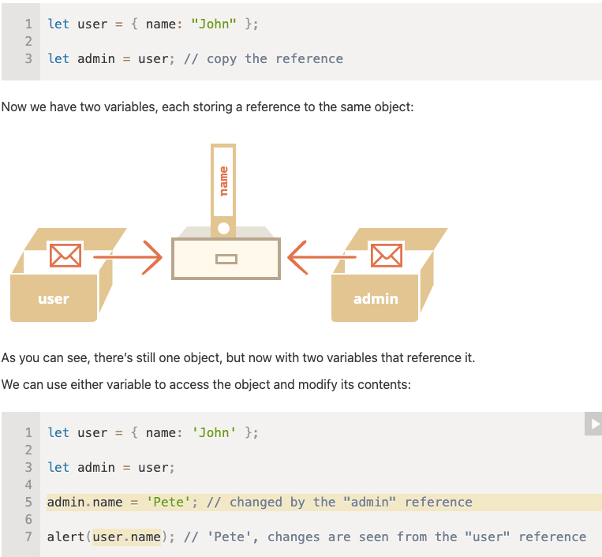
- Object.assign for the so-called “shallow copy”
- Nested objs have to be deeply cloned. Use [`_.cloneDeep(obj)`](https://lodash.com/docs/4.17.15#cloneDeep) from [lodash](https://lodash.com/docs/) lib

## **[Garbage Collection](https://javascript.info/garbage-collection)**

- Garbage collection is performed automatically. We cannot force or prevent it.

- Objects are retained in memory while they are reachable.

```js
function marry(man, woman) {
  woman.husband = man
  man.wife = woman

  return {
    father: man,
    mother: woman,
  }
}

let family = marry(
  {
    name: "John",
  },
  {
    name: "Ann",
  }
)

delete family.father
delete family.mother.husband
```

Deleted reference example

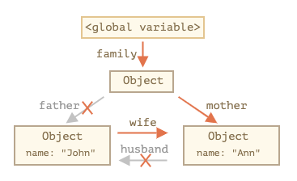

Garbage collected

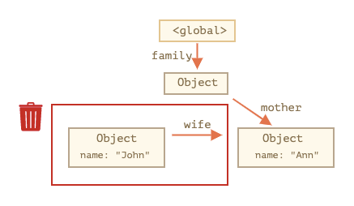

- Being referenced is not the same as being reachable (from a root): a pack of interlinked objects can become unreachable as a whole.

## **[Object methods, this](https://javascript.info/object-methods)**

- A method that calls `this` will allow access to the properties of the object in which the method is called

- Arrow functions have no `this`

## **[Constructor, operator "new"](https://javascript.info/constructor-new)**

```js
function User(name) {
  this.name = name
  this.isAdmin = false
}

let user = new User("Jack")

alert(user.name) // Jack
alert(user.isAdmin) // false

// essentially the constructor does this
function User(name) {
  // this = {};  (implicitly)

  // add properties to this
  this.name = name
  this.isAdmin = false

  // return this;  (implicitly)
}
```

- Usually, constructors do not have a return statement. Their task is to write all necessary stuff into this, and it automatically becomes the result.
- If return is called with an object, then the object is returned instead of this.
- If return is called with a primitive, it’s ignored.

## **[Optional chaining '?.'](https://javascript.info/optional-chaining)**

- Example with `value?.prop`
  - works as `value.prop`, if `value` exists,
  - otherwise (when `value` is undefined/null) it returns `undefined`.
- `user?.address.street.name` the `?.` allows `user` to safely be `null/undefined` (and returns `undefined` in that case), but that’s only for `user`

## **Summary**

The optional chaining `?.` syntax has three forms:

- `obj?.prop `– returns `obj.prop` if `obj` exists, otherwise `undefined`.
- `obj?.[prop]` – returns `obj[prop]` if `obj` exists, otherwise `undefined`.
- `obj.method?.()` – calls `obj.method()` if `obj.method` exists, otherwise returns `undefined`.

## **[Symbol Type](https://javascript.info/symbol)**

- `Symbol` is a primitive type for unique identifiers.

- Symbols are created with `Symbol()` call with an optional description (name).

- Symbols are always different values, even if they have the same name. If we want same-named symbols to be equal, then we should use the global registry: `Symbol.for(key)` returns (creates if needed) a global symbol with `key` as the name. Multiple calls of `Symbol.for` with the same `key` return exactly the same symbol.

- Two main use cases:

  1. “Hidden” object properties. If we want to add a property into an object that “belongs” to another script or a library, we can create a symbol and use it as a property key. A symbolic property does not appear in `for..in`, so it won’t be accidentally processed together with other properties. Also it won’t be accessed directly, because another script does not have our symbol. So the property will be protected from accidental use or overwrite.

  2. So we can “covertly” hide something into objects that we need, but others should not see, using symbolic properties. There are many system symbols used by JavaScript which are accessible as `Symbol.\*`. We can use them to alter some built-in behaviors. For instance, later in the tutorial we’ll use `Symbol.iterator` for iterables, `Symbol.toPrimitive` to setup object-to-primitive conversion and so on.

## **[Object to primitive conversion](https://javascript.info/object-toprimitive)**

## **ToPrimitive**

- `string` object-to-string conversion
- `number` obejct-to-number conversion
- `default`

- Conversion algorithm:

  1. Call obj `[Symbol.toPrimitive](hint)` if the method exists,
  2. Otherwise if hint is `"string"` try `obj.toString()` and `obj.valueOf()`, whatever exists.
  3. Otherwise if hint is "number" or "default" try `obj.valueOf()` and `obj.toString()`, whatever exists.

# **[Data types](https://javascript.info/data-types)**

## **[Primative Methods](https://javascript.info/primitives-methods)**

- 7 types of primatives: `string`, `number`, `bigint`, `boolean`, `symbol`, `null`, and `undefined`

## **[Numbers](https://javascript.info/number)**

- Regular JavaScript numbers are stored in 64-bit format, aka "double precision floating point number"

## **toString(base)**

- base=16 is used for hex colors, character encodings etc, digits can be 0..9 or A..F
- base=2 mostly for debugging bitwise operations, digits can be 0 or 1
- base=36 the whole latin alphabet is ued to represent a number.
  - use case: turn a long numeric identifier into something short. Ex: make a short url

```js
alert((12345).toString(36)) // 2n9c
```

## **Rounding**

- `Math.floor`
- `Math.ceil`
- `Math.round`
- `Math.trunc`

|      | Math.floor | Math.ceil | Math.round | Math.trunc |
| ---- | ---------- | --------- | ---------- | ---------- |
| 3.1  | 3          | 4         | 3          | 3          |
| 3.6  | 3          | 4         | 4          | 3          |
| -1.1 | -2         | -1        | -1         | -1         |
| -1.6 | -2         | -1        | -2         | -1         |

## **Imprecise Calculations**

```js
alert(0.1 + 0.2 == 0.3) // false
alert(0.1 + 0.2) // 0.30000000000000004

// fix
let sum = 0.1 + 0.2
alert(sum.toFixed(2)) // 0.30
```

## **parseInt and parseFloat**

```js
alert(+"100px") // NaN

alert(parseInt("100px")) // 100
alert(parseFloat("12.5em")) // 12.5

alert(parseInt("12.3")) // 12, only the integer part is returned
alert(parseFloat("12.3.4")) // 12.3, the second point stops the reading

alert(parseInt("a123")) // NaN, the first symbol stops the process
```

## **Other math functions**

- `Math.random()`, `Math.max(a, b, c, ...)`, `Math.pow(n, power)`

## **[Strings](https://javascript.info/string)**

## **Special Characters**

| Character        | Description                                                                                                                                                                            |
| ---------------- | -------------------------------------------------------------------------------------------------------------------------------------------------------------------------------------- |
| `\n`             | New line                                                                                                                                                                               |
| `\r`             | Carriage return: not used alone. Windows text files use a combination of two characters `\r\n` to represent a line break.                                                              |
| `\'`, `\"`       | Quotes                                                                                                                                                                                 |
| `\\`             | Backslash                                                                                                                                                                              |
| `\t`             | Tab                                                                                                                                                                                    |
| `\b`, `\f`, `\v` | Backspace, Form Feed, Vertical Tab – kept for compatibility, not used nowadays.                                                                                                        |
| `\xXX`           | Unicode character with the given hexadecimal Unicode `XX`, e.g. `'\x7A'` is the same as 'z'.                                                                                           |
| `\uXXXX`         | A Unicode symbol with the hex code `XXXX` in UTF-16 encoding, for instance `\u00A9` – is a Unicode for the copyright symbol ©. It must be exactly 4 hex digits.                        |
| `\u{X…XXXXXX}`   | (1 to 6 hex characters) A Unicode symbol with the given UTF-32 encoding. Some rare characters are encoded with two Unicode symbols, taking 4 bytes. This way we can insert long codes. |

## **Accessing characters**

```js
let str = `Hello`

// the first character
alert(str[0]) // H
alert(str.charAt(0)) // H

// the last character
alert(str[str.length - 1]) // o

alert(str[1000]) // undefined
alert(str.charAt(1000)) // '' (an empty string)

// iterate over string
for (let char of "Hello") {
  alert(char) // H,e,l,l,o (char becomes "H", then "e", then "l" etc)
}
```

## **Strings are immutable**

```js
let str = "Hi"

str[0] = "h" // error
alert(str[0]) // doesn't work
```

## **Searching for a substring**

`str.indexOf(substr, pos)` [.indexOf mdn link](https://developer.mozilla.org/en-US/docs/Web/JavaScript/Reference/Global_Objects/String/indexOf)

- beginning to end

`str.lastIndexOf(substr, position)`

- end to beginning

```js
let str = "Widget with id"

alert(str.indexOf("Widget")) // 0, because 'Widget' is found at the beginning
alert(str.indexOf("widget")) // -1, not found, the search is case-sensitive

alert(str.indexOf("id")) // 1, "id" is found at the position 1 (..idget with id)

alert(str.indexOf("id", 2)) // 12 w'id'get with 'id'

if (str.indexOf("Widget")) {
  alert("We found it") // doesn't work!
}

if (str.indexOf("Widget") != -1) {
  alert("We found it") // works now!
}
```

## **The bitwise NOT trick**

- Converts the number to a 32-bit integer (removes the decimal part if exists) and then reverses all bits in its binary representation

```js
alert(~2) // -3, the same as -(2+1)
alert(~1) // -2, the same as -(1+1)
alert(~0) // -1, the same as -(0+1)
alert(~-1) // 0, the same as -(-1+1)
```

```js
let str = "Widget"

// if (~str.indexOf(...)) reads as “if found”
if (~str.indexOf("Widget")) {
  alert("Found it!") // works
}
```

## **Searching in array**

### **includes, startsWith, endsWith**

- `str.includes(substr, pos)` returns true/false depending on whether `str` contains `substr`
- `str.startsWith` & `str.endsWith`

```js
alert("Widget".startsWith("Wid")) // true, "Widget" starts with "Wid"
alert("Widget".endsWith("get")) // true, "Widget" ends with "get"
```

### **Getting a substring**

3 methods: `substring`, `substr` and `slice`

- `str.slice(start [, end])` returns the part of the string from `start` to (but not including) `end`. **it is enough to just remember this one**

```js
let str = "stringify"
alert(str.slice(0, 5)) // 'strin', the substring from 0 to 5 (not including 5)
alert(str.slice(0, 1)) // 's', from 0 to 1, but not including 1, so only character at 0

// without first arg
alert(str.slice(2)) // 'ringify', from the 2nd position till the end

// start at the 4th position from the right, end at the 1st from the right
alert(str.slice(-4, -1)) // 'gif'
```

- `str.substring(start [,end])` 4eturns the part of the string between `start` and `end`. _negative args are not supported_

```js
let str = "stringify"

// these are same for substring
alert(str.substring(2, 6)) // "ring"
alert(str.substring(6, 2)) // "ring"

// ...but not for slice:
alert(str.slice(2, 6)) // "ring" (the same)
alert(str.slice(6, 2)) // "" (an empty string)
```

- `str.substr(start, [,length])` returns the part of the string from `start`, with the given `length`

```js
let str = "stringify"
alert(str.substr(2, 4)) // 'ring', from the 2nd position get 4 characters
alert(str.substr(-4, 2)) // 'gi', from the 4th position get 2 characters
```

## **Comparing strings**

- Lowercase > Uppercase
- Letters w/ diacriticial marks are "out of order"

```js
alert("Österreich" > "Zealand") // true
```

- `str.localeCompare(str2[, locales[, options]] )` [mdn link](https://developer.mozilla.org/en-US/docs/Web/JavaScript/Reference/Global_Objects/String/localeCompare) returns an integer indicating whether str is less, equal or greater than str2 according to the language rules:

  - negative number if str is less than str2.
  - positive number if str is greater than str2.
  - 0 if they are equivalent.

## **Summary**

There are several other helpful methods in strings:

- `str.trim()` – removes (“trims”) spaces from the beginning and end of the string.
- `str.repeat(n)` – repeats the string n times.
- …and more to be found in the [manual](https://developer.mozilla.org/en-US/docs/Web/JavaScript/Reference/Global_Objects/String).

## **[Arrays](https://javascript.info/array)**

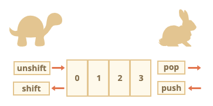

- `push(...items)` adds `items` to the end.
- `pop()` removes the element from the end and returns it.
- `shift()` removes the element from the beginning and returns it.
- `unshift(...items)` adds `items` to the beginning.
- loops an array without index `for (let item of arr)`

## **A word about "length"**

```js
let arr = [1, 2, 3, 4, 5]

arr.length = 2 // truncate to 2 elements
alert(arr) // [1, 2]

arr.length = 5 // return length back
alert(arr[3]) // undefined: the values do not return

arr.length = 0 // simple way to clear an array
```

## **[Array methods](https://javascript.info/array-methods)**

## **[splice](https://developer.mozilla.org/en-US/docs/Web/JavaScript/Reference/Global_Objects/Array/splice)**

`arr.splice(start[, deleteCount, elem1, ..., elemN])` returns elements removed

```js
// REMOVE AND REPLACE ==============================================

let arr = ["I", "study", "JavaScript", "right", "now"]

// remove 3 first elements and replace them with another
arr.splice(0, 3, "Let's", "dance")

alert(arr) // now ["Let's", "dance", "right", "now"]

// DELETE AND RETURN ===============================================

let arr = ["I", "study", "JavaScript", "right", "now"]

// remove 2 first elements
let removed = arr1.splice(0, 2)

alert(removed) // "I", "study" <-- array of removed elements

// INSERTING =======================================================
let arr = ["I", "study", "JavaScript"]

// from index 2
// delete 0
// then insert "complex" and "language"
arr.splice(2, 0, "complex", "language")

alert(arr) // "I", "study", "complex", "language", "JavaScript"

// NEGATIVE INDEX ALLOWED ==========================================

let arr = [1, 2, 5]

// from index -1 (one step from the end)
// delete 0 elements,
// then insert 3 and 4
arr.splice(-1, 0, 3, 4)

alert(arr) // 1,2,3,4,5
```

## **[slice](https://developer.mozilla.org/en-US/docs/Web/JavaScript/Reference/Global_Objects/Array/slice)**

`arr.slice([start], [end])` returns a new array copying to it all items from index `start` to `end` (not including `end`). Both `start` and `end` can be negative, in that case position from array end is assumed.

```js
let arr = ["t", "e", "s", "t"]

alert(arr.slice(1, 3)) // e,s (copy from 1 to 3)

alert(arr.slice(-2)) // s,t (copy from -2 till the end)
```

## **[concat](https://developer.mozilla.org/en-US/docs/Web/JavaScript/Reference/Global_Objects/Array/concat)**

`arr.concat(arg1, arg2...)` returns a new array that includes values from other arrays and additional items.

If `argN` is an array, all elements are copied. Otherwise, the argument itself is copied.

## **[forEach](https://developer.mozilla.org/en-US/docs/Web/JavaScript/Reference/Global_Objects/Array/foreach)**

```js
arr.forEach(function (item, index, array) {
  // ... do something with item
})
```

Allows to run a function for every element of the array.

## **Searching in array**

### **`indexOf`/`lastIndexOf` and includes**

```js
let arr = [1, 0, false]

alert(arr.indexOf(0)) // 1
alert(arr.indexOf(false)) // 2
alert(arr.indexOf(null)) // -1

alert(arr.includes(1)) // true

// Includes handles NaN ===========================================
const arr = [NaN]

alert(arr.indexOf(NaN)) // -1 (should be 0, but === equality doesn't work for NaN)
alert(arr.includes(NaN)) // true (correct)
```

### **[`find`](https://developer.mozilla.org/en-US/docs/Web/JavaScript/Reference/Global_Objects/**Arrafind) and `findIndex`\*\*

```js
let result = arr.find(function (item, index, array) {
  // if true is returned, item is returned and iteration is stopped
  // for falsy scenario returns undefined
})
```

```js
// Mainly used for an array of objects
let users = [
  { id: 1, name: "John" },
  { id: 2, name: "Pete" },
  { id: 3, name: "Mary" },
]

let user = users.find((item) => item.id == 1)

alert(user.name) // John
```

- [`arr.findIndex`](https://developer.mozilla.org/en-US/docs/Web/JavaScript/Reference/Global_Objects/Array/findIndex)) returns the index where the element was found instead of the element. Returns `-1` if nothing is found

### **[`filter`](https://developer.mozilla.org/en-US/docs/Web/JavaScript/Reference/Global_ObjectArray/filter)**

Used if there are more than one instance in an array. Returns an array of all matching elements

```js
let results = arr.filter(function (item, index, array) {
  // if true item is pushed to results and the iteration continues
  // returns empty array if nothing found
})
```

```js
let users = [
  { id: 1, name: "John" },
  { id: 2, name: "Pete" },
  { id: 3, name: "Mary" },
]

// returns array of the first two users
let someUsers = users.filter((item) => item.id < 3)

alert(someUsers.length) // 2
```

## **Transform an array**

### **[`map`](https://developer.mozilla.org/en-US/docs/Web/JavaScript/Reference/Global_Objects/Arramap)**

```js
let result = arr.map(function (item, index, array) {
  // returns the new value instead of item
})
```

### **[`sort(fn)`](https://developer.mozilla.org/en-US/docs/Web/JavaScript/Reference/Global_ObjectArray/sort)**

All elements are converted to strings during compare.

```js
let arr = [1, 2, 15]

// to sort numbers
arr.sort((a, b) => a - b) // 1, 2, 15

let countries = ["Österreich", "Andorra", "Vietnam"]

alert(countries.sort((a, b) => a.localeCompare(b))) // Andorra,Österreich,Vietnam (correct!)
```

### **[`reverse`](https://developer.mozilla.org/en-US/docs/Web/JavaScript/Reference/Global_ObjectArray/reverse)**

### **`split` and `join`**

**[split](https://developer.mozilla.org/en-US/docs/Web/JavaScript/Reference/Global_Objects/Array/split)[join](https://developer.mozilla.org/en-US/docs/Web/JavaScript/Reference/Global_Objects/Array/join)**

```js
// Split example
let names = "Bilbo, Gandalf, Nazgul"

let arr = names.split(", ")

for (let name of arr) {
  alert(`A message to ${name}.`) // A message to Bilbo  (and other names)
}

//  split with length arg
let arr = "Bilbo, Gandalf, Nazgul, Saruman".split(", ", 2)

alert(arr) // Bilbo, Gandalf
```

```js
// Join example
let arr = ["Bilbo", "Gandalf", "Nazgul"]

let str = arr.join(";") // glue the array into a string using ;

alert(str) // Bilbo;Gandalf;Nazgul
```

### **`reduce`/`reduceRight`**

**[reduce](https://developer.mozilla.org/en-US/docs/Web/JavaScript/Reference/Global_Objects/Array/reduce)[reduceRight](https://developer.mozilla.org/en-US/docs/Web/JavaScript/Reference/Global_Objects/Array/reduceRight)**

Used to calculate a single value based on the array.

```js
let value = arr.reduce(
  function (accumulator, item, index, array) {
    // ...
  },
  [initial]
)
```

### **[`Array.isArray(value)`](https://developer.mozilla.org/en-US/docs/Web/JavaScript/ReferencGlobal_ObjectArray/isArray)**

To check if array or not. Returns `true` or `false`.

### **Most methods support "thisArg"**

The value of `thisArg` parameter becomes `this` for `func`.

## **[Iterables](https://javascript.info/iterable)**

Allows us to make any object useable in a `for..of` loop.

```js
let range = {
  from: 1,
  to: 5,
}

// 1. call to for..of initially calls this
range[Symbol.iterator] = function () {
  // ...it returns the iterator object:
  // 2. Onward, for..of works only with this iterator, asking it for next values
  return {
    current: this.from,
    last: this.to,

    // 3. next() is called on each iteration by the for..of loop
    next() {
      // 4. it should return the value as an object {done:.., value :...}
      if (this.current <= this.last) {
        return { done: false, value: this.current++ }
      } else {
        return { done: true }
      }
    },
  }
}

// now it works!
for (let num of range) {
  alert(num) // 1, then 2, 3, 4, 5
}
```

### **Array-likes**

Array-likes: objects that have indexes and `length`, so they look like arrays.

### **[Array.from](https://developer.mozilla.org/en-US/docs/Web/JavaScript/Reference/Global_ObjectArray/from)**

Takes an iterable or array-like value and makes a "real" `Array` from it.

`Array.from(obj[, mapFn, thisArg])`

`mapFn` can be a function that will be applied to each element before adding it to the array.

`thisArg` allows us to set `this`

## **[Map and Set](https://javascript.info/map-set)**

### **[Map](https://developer.mozilla.org/en-US/docs/Web/JavaScript/Reference/Global_Objects/Map)**

Like an object, but `Map` allows keys of any type

Methods and properties are:

- `new Map()` – creates the map.
- `map.set(key, value)` – stores the value by the key.
- `map.get(key)` – returns the value by the key, undefined if key doesn’t exist in map.
- `map.has(key)` – returns true if the key exists, false otherwise.
- `map.delete(key)` – removes the value by the key.
- `map.clear()` – removes everything from the map.
- `map.size` – returns the current element count.

Unlike objects, keys are not converted to strings. Any type of key is possible.

**Map can also use objects as keys.**

#### **How Map compares keys**

To test keys for equivalence, Map uses the algorithm [SameValueZero](https://tc39.es/ecma262/#sec-samevaluezero). It is roughly the same as strict equality `===`, but the difference is that NaN is considered equal to NaN. So NaN can be used as the key as well.

This algorithm can’t be changed or customized.

#### **Chaining**

Every`map.set` call returns the map itself, so we can chain calls.

```js
map.set("1", "str1").set(1, "num1").set(true, "bool1")
```

### **Iteration over Map**

3 methods:

- `map.keys()` – returns an iterable for keys,
- `map.values()` – returns an iterable for values,
- `map.entries()` – returns an iterable for entries `[key, value]`, it’s used by default in `for..of`.

Map also has builtin `forEach` method

```js
// runs the function for each (key, value) pair
recipeMap.forEach((value, key, map) => {
  alert(`${key}: ${value}`) // cucumber: 500 etc
})
```

### **Object.entries: Map from Object**

We can use `Object.entries(obj)` to create a map on existing object.

```js
let obj = {
  name: "John",
  age: 30,
}

let map = new Map(Object.entries(obj))

alert(map.get("name")) // John
```

### **Object.fromEntries: Object from Map**

`Object.fromEntries` given an array of [key, value] pairs, it creates an object from them.

We can use `Object.fromEntries` to get a plain object from `Map`
.

```js
let map = new Map()
map.set("banana", 1)
map.set("orange", 2)
map.set("meat", 4)

// A call to map.entries() returns an iterable of key/value pairs, exactly in the right format for Object.fromEntries.
let obj = Object.fromEntries(map.entries()) // make a plain object (*)

// You can omit .entries() because Object.fromEntries expects an iterable object as the arg
let obj = Object.fromEntries(map) // omit .entries()

// done!
// obj = { banana: 1, orange: 2, meat: 4 }

alert(obj.orange) // 2
```

### **Set**

Methods and properties:

- `new Set([iterable])` – creates the set, with optional `iterable` (e.g. array) of values for initialization.
- `set.add(value)` – adds a value (does nothing if `value` exists), returns the set itself.
- ` set.delete(value)` – removes the value, returns `true` if `value` existed at the moment of the call, otherwise `false`.
- `set.has(value)` – returns `true` if the value exists in the set, otherwise `false`.
- `set.clear()` – removes everything from the set.
- `set.size` – is the elements count.

**Iteration over Map and Set is always in the insertion order, so we can’t say that these collections are unordered, but we can’t reorder elements or directly get an element by its number.**

## **[WeakMap and WeakSet](https://javascript.info/weakmap-weakset)**

### **Use case: caching**

```js
// 📁 cache.js
let cache = new Map()

// calculate and remember the result
function process(obj) {
  if (!cache.has(obj)) {
    let result = /* calculations of the result for */ obj

    cache.set(obj, result)
  }

  return cache.get(obj)
}

// Now we use process() in another file:

// 📁 main.js
let obj = {
  /* let's say we have an object */
}

let result1 = process(obj) // calculated

// ...later, from another place of the code...
let result2 = process(obj) // remembered result taken from cache

// ...later, when the object is not needed any more:
obj = null

alert(cache.size) // 1 (Ouch! The object is still in cache, taking memory!)
```

**Summary**

`WeakMap` is `Map`-like collection that allows only objects as keys and removes them together with associated value once they become inaccessible by other means.

`WeakSet` is `Set`-like collection that stores only objects and removes them once they become inaccessible by other means.

Their main advantages are that they have weak reference to objects, so they can easily be removed by garbage collector.

That comes at the cost of not having support for `clear`, `size`, `keys`, `values`...

`WeakMap` and `WeakSet` are used as “secondary” data structures in addition to the “primary” object storage. Once the object is removed from the primary storage, if it is only found as the key of `WeakMap` or in a `WeakSet`, it will be cleaned up automatically.

## **[Object.keys, values, entries](https://javascript.info/keys-values-entries)**

Following methods are available:

- `Object.keys(obj)` – returns an array of keys.
- `Object.values(obj)` – returns an array of values.
- `Object.entries(obj)` – returns an array of `[key, value]` pairs.

|             | Map          | Object                                 |
| ----------- | ------------ | -------------------------------------- |
| Call syntax | `map.keys()` | `Object.keys(obj)`, but not obj.keys() |
| Returns     | iterable     | “real” Array                           |

### **Transforming objects**

1. Use `Object.entries(obj)` to get an array of key/value pairs from `obj`.
2. Use array methods on that array, e.g. map.
3. Use `Object.fromEntries(array)` on the resulting array to turn it back into an object.

```js
let prices = {
  banana: 1,
  orange: 2,
  meat: 4,
}

let doublePrices = Object.fromEntries(
  // convert to array, map, and then fromEntries gives back the object
  Object.entries(prices).map(([key, value]) => [key, value * 2])
)

alert(doublePrices.meat) // 8
```

## **[Destructuring assignment](https://javascript.info/destructuring-assignment)**

### **Array Destructuring**

```js
// we have an array with the name and surname
let arr = ["John", "Smith"]

// destructuring assignment
// sets firstName = arr[0]
// and surname = arr[1]
let [firstName, surname] = arr
```

#### **The rest '...'**

```js
let [name1, name2, ...rest] = [
  "Julius",
  "Caesar",
  "Consul",
  "of the Roman Republic",
]

// rest is array of items, starting from the 3rd one
alert(rest[0]) // Consul
alert(rest[1]) // of the Roman Republic
alert(rest.length) // 2
```

#### **Default values**

```js
let [firstName, surname] = []

alert(firstName) // undefined
alert(surname) // undefined

// default values
let [name = "Guest", surname = "Anonymous"] = ["Julius"]

alert(name) // Julius (from array)
alert(surname) // Anonymous (default used)
```

### **Object destructuring**

```js
let [firstName, surname] = []

alert(firstName) // undefined
alert(surname) // undefined

// default values
let [name = "Guest", surname = "Anonymous"] = ["Julius"]

alert(name) // Julius (from array)
alert(surname) // Anonymous (default used)
```

#### **Nested Destructuring**

```js
let options = {
  size: {
    width: 100,
    height: 200,
  },
  items: ["Cake", "Donut"],
  extra: true,
}

// destructuring assignment split in multiple lines for clarity
let {
  size: {
    // put size here
    width,
    height,
  },
  items: [item1, item2], // assign items here
  title = "Menu", // not present in the object (default value is used)
} = options
```

#### **Smart function parameters**

When creating functions with a lot of parameters, just pass in an object of the arguments as a paramater instead. Inside the function, you can destructure the arguments from the object.

```js
// we pass object to function
let options = {
  title: "My menu",
  items: ["Item1", "Item2"],
}

// ...and it immediately expands it to variables
function showMenu({
  title = "Untitled",
  width = 200,
  height = 100,
  items = [],
}) {
  // title, items – taken from options,
  // width, height – defaults used
  alert(`${title} ${width} ${height}`) // My Menu 200 100
  alert(items) // Item1, Item2
}

// nested destructuring
function showMenu({
  title = "Untitled",
  width: w = 100, // width goes to w
  height: h = 200, // height goes to h
  items: [item1, item2], // items first element goes to item1, second to item2
}) {
  alert(`${title} ${w} ${h}`) // My Menu 100 200
  alert(item1) // Item1
  alert(item2) // Item2
}

showMenu(options)
```

Destructuring assumes that `showMenu()` does have an argument. If we want all values by default, then we should specify an empty object:

```js
function showMenu({ title = "Menu", width = 100, height = 200 } = {}) {
  alert(`${title} ${width} ${height}`)
}

showMenu() // Menu 100 200
```

### **[Data and time](https://javascript.info/date)**

#### **`new Date(milliseconds)`**

An integer number representing the number of milliseconds that has passed since the beginning of 1970 is called a timestamp.

Dates before 01.01.1970 have negative timestamps

#### **`new Date(datestring)`**

If there is a single argument, and it’s a string, then it is parsed automatically. Uses `Date.parse`.

#### **`new Date(year, month, date, hours, minutes, seconds, ms)`**

- The `year` must have 4 digits: `2013` is okay, `98` is not.
- The `month` count starts with `0` (Jan), up to `11` (Dec).
- The `date` parameter is actually the day of month, if absent then `1` is assumed.
- If `hours/minutes/seconds/ms` is absent, they are assumed to be equal `0`.

```js
new Date(2011, 0, 1, 0, 0, 0, 0) // 1 Jan 2011, 00:00:00
new Date(2011, 0, 1) // the same, hours etc are 0 by default

let date = new Date(2011, 0, 1, 2, 3, 4, 567)
alert(date) // 1.01.2011, 02:03:04.567
```

### **Access date components**

#### **[`getFullYear()`](https://developer.mozilla.org/en-US/docs/Web/JavaScript/Reference/**Global_Objects/Date/getFullYear)\*\*

Get the year (4 digits)

#### **[`getMonth()`](https://developer.mozilla.org/en-US/docs/Web/JavaScript/Reference/Global_Objects/**Date/getMonth)\*\*

Get the month, from 0 to 11.

#### **[`getDate()`](https://developer.mozilla.org/en-US/docs/Web/JavaScript/Reference/Global_Objects/**Date/getDate)\*\*

Get the day of month, from 1 to 31, the name of the method does look a little bit strange.

#### **`getHours()`, `getMinutes()`, `getSeconds()`, `getMilliseconds()`**

Mdn links:
[`getHours()`](https://developer.mozilla.org/en-US/docs/Web/JavaScript/Reference/Global_Objects/Date/getHours), [`getMinutes()`](https://developer.mozilla.org/en-US/docs/Web/JavaScript/Reference/Global_Objects/Date/getMinutes), [`getSeconds()`](https://developer.mozilla.org/en-US/docs/Web/JavaScript/Reference/Global_Objects/Date/getSeconds), [`getMilliseconds()`](https://developer.mozilla.org/en-US/docs/Web/JavaScript/Reference/Global_Objects/Date/getMilliseconds)

Get the corresponding time components.

#### **[`getDay()`](https://developer.mozilla.org/en-US/docs/Web/JavaScript/Reference/Global_Objects/Date/getDay)**

Get the day of week, from 0 (Sunday) to 6 (Saturday). The first day is always Sunday, in some countries that’s not so, but can’t be changed.

**All the methods above return the components relative to the local time zone.**

No UTC-variant:

#### **[`getTime()`](https://developer.mozilla.org/en-US/docs/Web/JavaScript/Reference/Global_Objects/Date/getTime)**

Returns the timestamp for the date – a number of milliseconds passed from the January 1st of 1970 UTC+0.

#### **[`getTimezoneOffset()`](https://developer.mozilla.org/en-US/docs/Web/JavaScript/Reference/Global_Objects/Date/getTimezoneOffset)**

Returns the difference between UTC and the local time zone, in minutes:

### **Autocorrection**

We can set out-of-range values, and it will auto-adjust itself.

### **Date to number, date diff**

`Date` object convert to number = timestamp = same as `date.getTime()`.

Dates can be subtracted, result is difference in ms.

### **Date.now()**

If we just want to measure time. `Date.now()` = `new Date().getTime()`. `Date.now()` doesnt create an intermediate `Date` object. It's faster and doesn't put pressure on garbage collection.

### **Benchmarking**

```js
function diffSubtract(date1, date2) {
  return date2 - date1
}

function diffGetTime(date1, date2) {
  return date2.getTime() - date1.getTime()
}

function bench(f) {
  let date1 = new Date(0)
  let date2 = new Date()

  let start = Date.now()
  for (let i = 0; i < 100000; i++) f(date1, date2)
  return Date.now() - start
}

let time1 = 0
let time2 = 0

// added for "heating up" prior to the main loop
bench(diffSubtract)
bench(diffGetTime)

// run bench(diffSubtract) and bench(diffGetTime) each 10 times alternating
for (let i = 0; i < 10; i++) {
  time1 += bench(diffSubtract)
  time2 += bench(diffGetTime)
}

alert("Total time for diffSubtract: " + time1)
alert("Total time for diffGetTime: " + time2)
```

### **[`Date.parse`](https://developer.mozilla.org/en-US/docs/Web/JavaScript/Reference/**Global_ObjectDate/parse) from a string\*\*

`YYYY-MM-DDTHH:mm:ss.sssZ` returns the timestamp

- `YYYY-MM-DD` – is the date: year-month-day. Can also use `YYYY-MM` or `YYYY`.
- The character `"T"` is used as the delimiter.
- `HH:mm:ss.sss` – is the time: hours, minutes, seconds and milliseconds.
- The optional `"Z"` part denotes the time zone in the format `+-hh:mm`. A single letter `Z` would mean UTC+0.

## **[JSON methods](https://javascript.info/json)**

### **`JSON.stringify`**

Convert object to string. Can also be applied to primitives. Single quotes -> Double quotes, object property names -> double quotes.

JSON is data-only language-independent. Some JavaScript object properties are skipped:

- Function properties (methods).
- Symbolic keys and values.
- Properties that store `undefined`.

```js
let user = {
  sayHi() {
    // ignored
    alert("Hello")
  },
  [Symbol("id")]: 123, // ignored
  something: undefined, // ignored
}

alert(JSON.stringify(user)) // {} (empty object)
```

Nested objects are converted automatically.

_No circular references_

### **Excluding and transforming: replacer**

`JSON.stringify(value[, replacer, space])`

#### **value**

A value to encode.

#### **replacer**

Array of properties to encode or a mapping function function(key, value).

#### **space**

Amount of space to use for formatting

```js
let room = {
  number: 23,
}

let meetup = {
  title: "Conference",
  participants: [{ name: "John" }, { name: "Alice" }],
  place: room, // meetup references room
}

room.occupiedBy = meetup // room references meetup

alert(JSON.stringify(meetup, ["title", "participants"]))
// {"title":"Conference","participants":[{},{}]}

alert(
  JSON.stringify(meetup, ["title", "participants", "place", "name", "number"])
)
/*
{
  "title":"Conference",
  "participants":[{"name":"John"},{"name":"Alice"}],
  "place":{"number":23}
}
*/

alert(
  JSON.stringify(meetup, function replacer(key, value) {
    alert(`${key}: ${value}`)
    return key == "occupiedBy" ? undefined : value
  })
)

/* key:value pairs that come to replacer:
:             [object Object]
title:        Conference
participants: [object Object],[object Object]
0:            [object Object]
name:         John
1:            [object Object]
name:         Alice
place:        [object Object]
number:       23
occupiedBy: [object Object]
*/
```

### **Formatting: space**

```js
let user = {
  name: "John",
  age: 25,
  roles: {
    isAdmin: false,
    isEditor: true
  }
};

alert(JSON.stringify(user, null, 2));
/* two-space indents:
{
  "name": "John",
  "age": 25,
  "roles": {
    "isAdmin": false,
    "isEditor": true
  }
}
```

### **Custom “toJSON”**

Objects may provide `toJSON` method for to-JSON convsersions. `JSON.stringify` will automatically call the `toJSON` method if it's available.

### **`JSON.parse`**

`JSON.parse(str, [reviver]);`

To decode a JSON-string

#### **str**

JSON-string to parse.

#### **reviver**

Optional function(key,value) that will be called for each (key, value) pair and can transform the value.

Mistakes for hand-written JSON:

```js
let json = `{
  name: "John",                     // mistake: property name without quotes
  "surname": 'Smith',               // mistake: single quotes in value (must be double)
  'isAdmin': false                  // mistake: single quotes in key (must be double)
  "birthday": new Date(2000, 2, 3), // mistake: no "new" is allowed, only bare values
  "friends": [0,1,2,3]              // here all fine
}`
```

### **Using reviver**

```js
let str = '{"title":"Conference","date":"2017-11-30T12:00:00.000Z"}'

let meetup = JSON.parse(str)

alert(meetup.date.getDate()) // Error!

let meetup = JSON.parse(str, function (key, value) {
  if (key == "date") return new Date(value)
  return value
})

alert(meetup.date.getDate()) // now works!
```

## **[Advanced working with functions](https://javascript.info/advanced-functions)**

### **[Recursion and Stack](https://javascript.info/recursion)**

Recursion depth equals the maximal number of context in the stack.

#### **The execution context and stack**

Information about the process of execution of a running function is stored in _execution context_.

One function has one execution context associated with it.

#### **Recursive traversals**

```js
let company = {
  // the same object, compressed for brevity
  sales: [
    { name: "John", salary: 1000 },
    { name: "Alice", salary: 1600 },
  ],
  development: {
    sites: [
      { name: "Peter", salary: 2000 },
      { name: "Alex", salary: 1800 },
    ],
    internals: [{ name: "Jack", salary: 1300 }],
  },
}

// The function to do the job
function sumSalaries(department) {
  if (Array.isArray(department)) {
    // case (1)
    return department.reduce((prev, current) => prev + current.salary, 0) // sum the array
  } else {
    // case (2)
    let sum = 0
    for (let subdep of Object.values(department)) {
      sum += sumSalaries(subdep) // recursively call for subdepartments, sum the results
    }
    return sum
  }
}

alert(sumSalaries(company)) // 7700
```

#### **Recursive structures**

HTML document, an HTML-tag may contain a list of:

- Text pieces.
- HTML-comments.
- Other HTML-tags (that in turn may contain text pieces/comments or other tags etc).

#### **# Linked List**

### **[Rest parameters and spread syntax](https://javascript.info/rest-parameters-spread)**

#### **Rest parameters `...`**

Rest parameters must always go at the end.

```js
function sumAll(...args) {
  // args is the name for the array
  let sum = 0

  for (let arg of args) sum += arg

  return sum
}

alert(sumAll(1)) // 1
alert(sumAll(1, 2)) // 3
alert(sumAll(1, 2, 3)) // 6
```

#### **The “arguments” variable**

Special array-like object that contains all arguments by index. Not used much any more. Cannot use array methods with `arguments` variable. Arrow functions do not have `arguments`.

#### **Spread syntax**

Spread syntax uses iterators to gather elements, same way as `for..of`.

#### **Copy an array/object**

```js
let obj = { a: 1, b: 2, c: 3 }

let objCopy = { ...obj } // spread the object into a list of parameters
// then return the result in a new object

// the above is the same as below
let objCopyAssign = Object.assign({}, obj)

// do the objects have the same contents?
alert(JSON.stringify(obj) === JSON.stringify(objCopy)) // true

// are the objects equal?
alert(obj === objCopy) // false (not same reference)
```

### **[Variable scope, closure](https://javascript.info/closure)**

#### **Lexical Environment**

#### **# 1. Variables**

In JS, there is an internal (hidden) associated object known as the _Lexical Environment_.

Lexical Environment (LE) consists of 2 parts:

1. _Environment Record_ - an object that stores all local variables as its properties (and other information like the value of `this`).
2. A reference to the _outer lexical environment_.

**A variable is just a property of the special internal object, `Enviroment Record`. To get or change a variable means to get ro change a property of that object.**

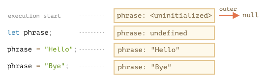

#### **# 2. Function Declarations**

Function declaration is instantally fully initialized.

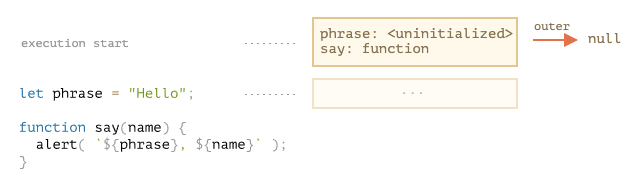

This only happens with function declarations and not function expressions such as `let say = function(name)...`.

#### **# 3. Inner and outer LE**

When a function runs, at the beginning of the call, a new LE is created automatically to store local variables and parameters of the call.

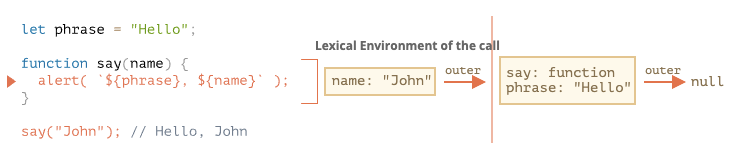

During function call we have two LEs: inner for fn call, outer for global.

Inner LE has a reference to the outer one.

**When code wants to access a variable, it always starts with the inner, then works outward.**

If a variable is not found anywhere, that’s an error in strict mode (without use strict, an assignment to a non-existing variable creates a new global variable, for compatibility with old code).

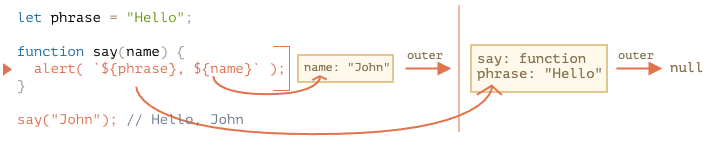

#### **# 4. Returning a function**

```js
function makeCounter() {
  let count = 0

  return function () {
    return count++
  }
}

let counter = makeCounter()
```

At the beginning of each `makeCounter()` call, a new Lexical Environment object is created, to store variables for this `makeCounter` run.

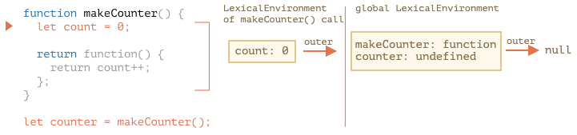

At first, the nested `function()` does not run, it is only created.

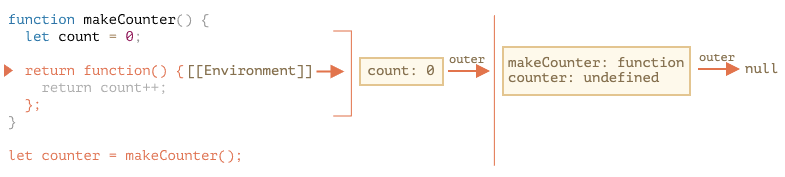

`counter.[[Enviroment]]` has the reference to `{count: 0}` LE. `[[Environment]]` reference is set once and forever at fucntion creation time.

When `counter()` is called, a new LE is created for call, and its outer LE reference is taken from `counter.[[Environment]]`

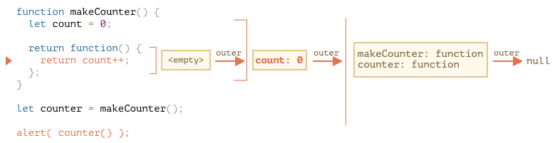

When code inside `counter()` looks for `count` variable, it searches its own LE. If it's not there, it moves to next outer LE.

**The `count` variable is updated in the LE where it lives.**

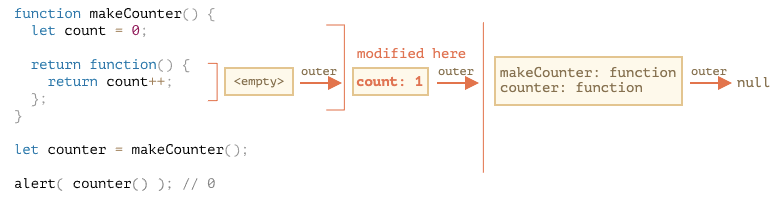

#### **# Closure**

A closure is a function that remembers its outer variables and can access them. In JS, all fns are naturally closures. Fns automatically remember where they were created using a hidden `[[Enviroment]]` property, and then their code can access outer variables.

_From Amanda's email:_

A closure is a way of keeping access to variables in a function after that function has returned.

A closure is the combination of a function bundled together (enclosed) with references to its surrounding state (the lexical environment). In other words, a closure gives you access to an outer function’s scope from an inner function. In JavaScript, closures are created every time a function is created, at function creation time.

To use a closure, define a function inside another function and expose it. To expose a function, return it or pass it to another function.

The inner function will have access to the variables in the outer function scope, even after the outer function has returned.

In JavaScript, closures are the primary mechanism used to enable data privacy. When you use closures for data privacy, the enclosed variables are only in scope within the containing (outer) function. You can’t get at the data from an outside scope except through the object’s privileged methods.

Currying function or Callback can be considered closures

### **Garbage Collection**

Usually, a LE is removed from memory with all the variables after the fn call finishes. As any JS object, it's only kept in memory while it's reachable. If there's a nested fn that si still reachable after the end of a fn, then it has `[[Environment]]` property that references the LE.

```js
function f() {
  let value = 123

  return function () {
    alert(value)
  }
}

let g = f() // g.[[Environment]] stores a reference to the Lexical Environment
// of the corresponding f() call

// 3 functions in array, every one of them links to Lexical Environment
// from the corresponding f() run
let arr = [f(), f(), f()]

g = null // ...and now the memory is cleaned up
```

#### **Real-life optimizations**

Javascript engines will try to optimize keeping all outer variables alive while function is alive.

**An important side effect in V8 (Chrome, Edge, Opera) is that such variable will become unavailable in debugging.**

```js
function f() {
  let value = Math.random()

  function g() {
    // As you could see – there is no such variable! In theory, it should be accessible, but the engine optimized it out.
    debugger // in console: type alert(value); No such variable!
  }

  return g
}

let g = f()
g()
```

```js
let value = "Surprise!"

function f() {
  let value = "the closest value"

  function g() {
    debugger // in console: type alert(value); Surprise!
  }

  return g
}

let g = f()
g()
```

## **[The old "var"](https://javascript.info/var)**

Skipped for now.

## **[Global object](https://javascript.info/global-object)**

Global object provides variables and functions that are available anywhere.

In a browser it is named `window`, for Node.js it is `global`, for other environments it may have another name.

Recently, `globalThis` was added to the language, as a standardized nme for a global objct, that should be supported across all environments.

```js
alert("Hello")
// is the same as
window.alert("Hello")
```

Global fns and variables declared with `var` become the property of the global object. Does not happen with `let`/`const`.

If you want something to be accessed globally, write it directly as below. **Using global variables is generally discouraged and/or used minimally.**

```js
// make current user information global, to let all scripts access it
window.currentUser = {
  name: "John",
}

// somewhere else in code
alert(currentUser.name) // John

// or, if we have a local variable with the name "currentUser"
// get it from window explicitly (safe!)
alert(window.currentUser.name) // John
```

### **Using for polyfills**

Use the global object to test for support of modern language features.

```js
if (!window.Promise) {
  alert("Your browser is really old!")
  window.Promise = ... // custom implementation of the modern language feature
}
```

## **[Function object, NFE](https://javascript.info/function-object)**

Fns are objects. Imagine functions as callable "action objects". We can call them, add/remove properties, pass by ref etc.

### **The name property**

A fn's name is accessible as the "name" property.

Even assigns correct name to a function if it's created without one.

```js
let sayHi = function () {
  alert("Hi")
}

alert(sayHi.name) // sayHi (there's a name!)
```

Also works as a default value in a fn parameter.

Names can be figured out from context.

```js
let user = {
  sayHi() {
    // ...
  },

  sayBye: function () {
    // ...
  },
}

alert(user.sayHi.name) // sayHi
alert(user.sayBye.name) // sayBye
```

Doesn't always work though.

```js
// function created inside array
let arr = [function () {}]

alert(arr[0].name) // <empty string>
// the engine has no way to set up the right name, so there is none
```

### **The length property**

Returns number of fn parameters. Rest parameters are not counted.

For instance, in the code below the `ask` function accepts a `question` to ask and an arbitrary number of handler functions to call.

Once a user provides their answer, the function calls the handlers. We can pass two kinds of handlers:

A zero-argument function, which is only called when the user gives a positive answer.
A function with arguments, which is called in either case and returns an answer.

To call `handler` the right way, we examine the `handler.length` property.

The idea is that we have a simple, no-arguments handler syntax for positive cases (most frequent variant), but are able to support universal handlers as well:

```js
function ask(question, ...handlers) {
  let isYes = confirm(question)

  for (let handler of handlers) {
    if (handler.length == 0) {
      if (isYes) handler()
    } else {
      handler(isYes)
    }
  }
}

// for positive answer, both handlers are called
// for negative answer, only the second one
ask(
  "Question?",
  () => alert("You said yes"),
  (result) => alert(result)
)
```

### **Custom properties**

```js
function sayHi() {
  alert("Hi")

  // let's count how many times we run
  sayHi.counter++
}
sayHi.counter = 0 // initial value

sayHi() // Hi
sayHi() // Hi

alert(`Called ${sayHi.counter} times`) // Called 2 times
```

**A property is not a variable. `let counter` and a property `counter` are two unrelated things.**

Fn properties can replace closures sometimes.

Rewritten from [variable scope, closure](#variable-scope-closure) section.

```js
function makeCounter() {
  // instead of:
  // let count = 0

  function counter() {
    return counter.count++
  }

  counter.count = 0

  return counter
}

let counter = makeCounter()
alert(counter()) // 0
alert(counter()) // 1
```

The `count` is now stored in the fn directly, not in its outer LE.

Main difference between this way and closure way: if `count` lives in an outer variable, then external code is unable to access it. Only nested fns may modify it. If it's bound to a fn, then this is possible:

```js
function makeCounter() {
  function counter() {
    return counter.count++
  }

  counter.count = 0

  return counter
}

let counter = makeCounter()

counter.count = 10
alert(counter()) // 10
```

### **Named Fn Expression**

Term for fn expressions that have a name.

```js
let sayHi = function func(who) {
  alert(`Hello, ${who}`)
}

sayHi("John") // Hello, John
```

The fn call is still `sayHi(...)`.

2 special things about the name `func`:

1. Allows the fn to reference itself internally.
2. It is not visible outside of the fn.

```js
let sayHi = function func(who) {
  if (who) {
    alert(`Hello, ${who}`)
  } else {
    func("Guest") // use func to re-call itself
  }
}

sayHi() // Hello, Guest

// But this won't work:
func() // Error, func is not defined (not visible outside of the function)
```

Why use `func`? In most cases we can use `sayHi` for the nested call.

The problem with using `sayHi` for the nested call is that `sayHi` may change in the outer code.

```js
let sayHi = function (who) {
  if (who) {
    alert(`Hello, ${who}`)
  } else {
    sayHi("Guest") // Error: sayHi is not a function
  }
}

let welcome = sayHi
sayHi = null

welcome() // Error, the nested sayHi call doesn't work any more!
```

That happens because the function takes `sayHi` from its outer lexical environment. There’s no local `sayHi`, so the outer variable is used. And at the moment of the call that outer `sayHi` is `null`.

Use `func` as the named function express will fix the code above. This works because the name `"func" `is function-local. It is not taken from outside (and not visible there). The specification guarantees that it will always reference the current function.

The outer code still has its variable sayHi or welcome. And func is an “internal function name”, how the function can call itself internally.

No such thing for `Function Declaration`.

## **[The "new Function" syntax](https://javascript.info/new-function)**

Takes string to make fn.

```js
let func = new Function([arg1, arg2, ...argN], functionBody)

let sum = new Function("a", "b", "return a + b")

alert(sum(1, 2)) // 3

let sayHi = new Function('alert("Hello")')

sayHi() // Hello
```

### **Closures**

When a fn is created using `new Function`, its `[[Environment]]` is set to reference the global one. Such fn doesn't have access to outer variables, only to the global ones.

## **[Scheduling: setTimeout and setInterval](https://javascript.info/settimeout-setinterval)**

- `setTimeout` run a fn once after the interval of time.
- `setInterval` run a fn repeatedly, starting after the itnerval of time, then repeating continuously at that interval.

### **setTimeout**

```js
let timerId = setTimeout(func|code, [delay], [arg1], [arg2], ...)
```

#### **`func|code`**

Fn or string of code to execute. Usually it's a fn.

#### **`delay`**

The delay before run, in ms (1000ms = 1 sec), by default 0.

#### **`arg1, arg2`...**

Arguments for the fn (not supported in IE9)

#### **Pass a fn, but don't run it**

```js
setTimeout(sayHi(), 1000) // wrong!
```

`setTimeout` expects a reference to a fn. `sayHi()` runs the fn and the result of its execution is passed to `setTimeout`.

#### **`Canceling with clearTimeout`**

`setTimeout` returns a `timerId` that we can use to cancel the execution.

```js
let timerId= setTimeout(...)
clearTimeout(timerId);
```

In a browser the timer identifier is a number. In other environments, this can be something else. Ex. node returns timer obj with additional methods.

### **setInterval**

```js
let timerId = setInterval(func|code, [delay], [arg1], [arg2], ...)
```

Runs regularly after the given interval of time. To stop further calls, use `clearInterval(timerId)`.

```js
// show message every 2 secs, after 5 seconds, stop
// repeat with the interval of 2 seconds
let timerId = setInterval(() => alert("tick"), 2000)

// after 5 seconds stop
setTimeout(() => {
  clearInterval(timerId)
  alert("stop")
}, 5000)
```

#### **Time goes on while `alert` is shown**

If you run the above code without dismissing the alert, then the next `alert` will be shown immediately as you do it. This happens with `alert/confirm/prompt`.

### **Nested timeout**

**Nested setTimeout allows to set the delay between the executions more precisely than setInterval.**

```js
let i = 1
setInterval(function () {
  func(i++)
}, 100)
```

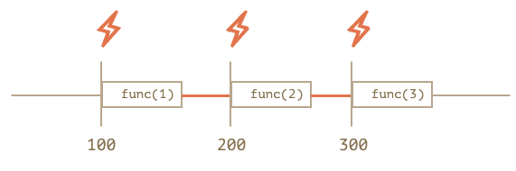

`func`'s execution consumes a part of the interval. It is possible for `func`'s execution tot take longer than 100ms. In this case the engine waits for `func` to complete, then checks the scheduler and if the tiem is up, runs it again _immediately_. `setInterval` will run for as long as it takes the func to execute.

```js
let i = 1
setTimeout(function run() {
  func(i++)
  setTimeout(run, 100)
}, 100)
```

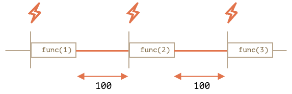

**`setTimeout` will guarantee the fixed delay.**

#### **Garbagte collection and setInterval/setTimeout callback**

When fn is passed in `setInterval/setTimeout`, an internal reference is created to it and saved in the scheduler. This prevents the fn from being garbage collected, even if there are no other references to it.

```js
// the function stays in memory until the scheduler calls it
setTimeout(function() {...}, 100);
```

`setInterval` the fn stays in memory until `clearInterval` is called.

Caution side-effect: a fn references the outer LE, so, while it lives, outer variables live too. The variables maytake much more memory than the fn itself, so when we don't need the fn any more, it's better to cancel it.

### **Zero delay setTimeout**

`setTimeout(func, 0)`, or just `setTimeout(func)`.

This schedules the execution of `func` ASAP. But the scheduler will invoke it only after the currently executing script is complete.

#### **Zero delay is in fact not zero (in a browser)**

The [HTML5 standard](https://html.spec.whatwg.org/multipage/timers-and-user-prompts.html#timers) says: “after five nested timers, the interval is forced to be at least 4 milliseconds.”.

```js
let start = Date.now()
let times = []

setTimeout(function run() {
  times.push(Date.now() - start) // remember delay from the previous call

  if (start + 100 < Date.now()) alert(times)
  // show the delays after 100ms
  else setTimeout(run) // else re-schedule
})

// an example of the output:
// 1,1,1,1,9,15,20,24,30,35,40,45,50,55,59,64,70,75,80,85,90,95,100
```

Similiar thing happens to `setInterval` instead of `setTimeout`.

## **[Decorators and forwarding, call/apply](https://javascript.info/call-apply-decorators)**

### **Transparent caching**

Say we have a fn `slow(x)` which is CPU-heavy, but results are stable. Meaning that the `x` always returns the same results. We may want to cache the results to avoid spending extra-time on recalcuations. Instead of adding that functionality into `slow()` we'll create a wrapper fn.

```js
function slow(x) {
  // there can be a heavy CPU-intensive job here
  alert(`Called with ${x}`)
  return x
}

function cachingDecorator(func) {
  let cache = new Map()

  return function (x) {
    if (cache.has(x)) {
      // if there's such key in cache
      return cache.get(x) // read the result from it
    }

    let result = func(x) // otherwise call func

    cache.set(x, result) // and cache (remember) the result
    return result
  }
}

slow = cachingDecorator(slow)

alert(slow(1)) // slow(1) is cached and the result returned
alert("Again: " + slow(1)) // slow(1) result returned from cache

alert(slow(2)) // slow(2) is cached and the result returned
alert("Again: " + slow(2)) // slow(2) result returned from cache
```

`cachingDecorator` is a _decorator_, a special fn that takes another fn and alters its behavior.
The idea is that we can call `cachingDecorator` for any fn, and it will return the caching wrapper.

Why `cachingDecorator` is as a wrapper is better than adding the caching logic inside `slow()`:

- The cachingDecorator is reusable. We can apply it to another function.
- The caching logic is separate, it did not increase the complexity of slow itself (if there was any).
- We can combine multiple decorators if needed (other decorators will follow).

### **Using "func.call" for the context**

The caching decorator above is not suited to work with object methods.

For example:

```js
// we'll make worker.slow caching
let worker = {
  someMethod() {
    return 1
  },

  slow(x) {
    // scary CPU-heavy task here
    alert("Called with " + x)
    return x * this.someMethod() // (*)
  },
}

// same code as before
function cachingDecorator(func) {
  let cache = new Map()
  return function (x) {
    if (cache.has(x)) {
      return cache.get(x)
    }
    let result = func(x) // (**)
    cache.set(x, result)
    return result
  }
}

alert(worker.slow(1)) // the original method works

worker.slow = cachingDecorator(worker.slow) // now make it caching

alert(worker.slow(2)) // Whoops! Error: Cannot read property 'someMethod' of undefined
```

The error occurs in the line `(*)` that tries to access `this.someMethod` and fails.

The reason is that the wrapper calls the original function as `func(x)` in the line `(**)`. And, when called like that, the function gets `this = undefined`. The wrapper passes the call to the original method, but w/o the context `this`.

To fix, there's a special built-in fn method [func.call(context, ...args)](https://developer.mozilla.org/en-US/docs/Web/JavaScript/Reference/Global_Objects/Function/call) that allows to call a fn explicitiy setting `this`.

It runs `func` providing the first argument as `this`, and the next as the arguments.

These are the same:

```js
func(1, 2, 3)
func.call(obj, 1, 2, 3)
```

Only diff is that `func.call` sets `this` to `obj`.

To fix broken example:

```js
let result = func.call(this, x) // "this" is passed correctly now
```

### **Going multi-argument**

```js
let worker = {
  slow(min, max) {
    alert(`Called with ${min},${max}`)
    return min + max
  },
}

function cachingDecorator(func, hash) {
  let cache = new Map()
  return function () {
    let key = hash(arguments) // (*)
    if (cache.has(key)) {
      return cache.get(key)
    }

    let result = func.call(this, ...arguments) // (**)

    cache.set(key, result)
    return result
  }
}

function hash(args) {
  return args[0] + "," + args[1]
}

worker.slow = cachingDecorator(worker.slow, hash)

alert(worker.slow(3, 5)) // works
alert("Again " + worker.slow(3, 5)) // same (cached)
```

#### **func.apply**

Instead of `func.call(this, ...arguments)` we could use `func.apply(this, arguments)`.

`arguments` is an array-like object. Only diff b/w `call` and `apply` is that `call` expects a list of arguments, while `apply` takes an array-like object.

These are the same:

```js
func.call(context, ...args) // pass an array as list with spread syntax
func.apply(context, args) // is same as using call
```

#### **Borrowing a method**

Improve hashing fn from above by

```js
// old hashing fn
function hash(args) {
  return args[0] + "," + args[1]
  // return args.join() doesn't work because arguments object is both iterable and array-like, but not a real array.
}

// new hashing fn
function hash() {
  alert([].join.call(arguments)) // 1,2
}

hash(1, 2)
```

We borrow a join method from a regular array (`[].join`) and use `[].join.call`. The internal algorithm `arr.join(glue)`.

1. Let `glue` be the first argument or, if no arguments, then a comma ",".
2. Let `result` be an empty string.
3. Append `this[0]` to `result`.
4. Append `glue` and `this[1]`.
5. Append `glue` and `this[2]`.
6. …Do so until this.length items are glued.
7. Return result.

So, technically it takes `this` and joins `this[0]`, `this[1]` …etc together. It’s intentionally written in a way that allows any array-like `this` (not a coincidence, many methods follow this practice). That’s why it also works with `this=arguments`.

### **Decorators and function properties**

It is generally safe to replace a function or a method with a decorated one, except for one little thing. If the original function had properties on it, like func.calledCount or whatever, then the decorated one will not provide them. Because that is a wrapper. So one needs to be careful if one uses them.

E.g. in the example above if `slow` function had any properties on it, then `cachingDecorator(slow)` is a wrapper without them.

## **[Function binding](https://javascript.info/bind)**

### **Losing "this"**

Once a method is passed somewhere separately from the object - `this` is lost.

```js
let user = {
  firstName: "John",
  sayHi() {
    alert(`Hello, ${this.firstName}!`)
  },
}

setTimeout(user.sayHi, 1000) // Hello, undefined!
```

### **Solution 1: a wrapper**

```js
setTimeout(function () {
  user.sayHi() // Hello, John!
}, 1000)
```

Works now because it receives `user` from the outer LE, then calls the method normally. But the solution is not good enough. What if there's a 1 sec delay?

```js
setTimeout(() => user.sayHi(), 1000)

// ...the value of user changes within 1 second
user = {
  sayHi() {
    alert("Another user in setTimeout!")
  },
}

// Another user in setTimeout!
```

### **Solution 2: bind**

[mdn link](https://developer.mozilla.org/en-US/docs/Web/JavaScript/Reference/Global_Objects/Function/bind)

```js
func.bind(context)
```

`this=context`

```js
let user = {
  firstName: "John",
}

function func() {
  alert(this.firstName)
}

let funcUser = func.bind(user) // this=user
funcUser() // John

/*
All arguments are passed to the original func "as is"
*/
funcUser("Hello") // Hello, John (argument "Hello" is passed, and this=user)
```

#### **Convenience method: `bindAll`**

If an object has many methods and we plan to actively pass it around, then we could bind them all in a loop:

```js
for (let key in user) {
  if (typeof user[key] == "function") {
    user[key] = user[key].bind(user)
  }
}
```

lodash lib has a fn: [`_.bindAll(object, methodNames)`](http://lodash.com/docs#bindAll)

### **Partial fns**

Bind arguments. Allows to bind context as `this` and starting arguments of the fn.

```js
let bound = func.bind(context, [arg1], [arg2], ...);
```

```js
function mul(a, b) {
  return a * b
}

// We don't actually use this here, but bind requires it so we use null.
let double = mul.bind(null, 2)

alert(double(3)) // = mul(2, 3) = 6
alert(double(4)) // = mul(2, 4) = 8
alert(double(5)) // = mul(2, 5) = 10
```

Bound argument is the first argument.

Benefit of partial fn is that we can create an independent fn w/ a readable name (`double`, `triple`). We can use it and not provide the first argument every time. For instance, we have a function `send(from, to, text)`. Then, inside a `user` object we may want to use a partial variant of it: `sendTo(to, text)` that sends from the current user.

### **Going partial without context**

```js
function partial(func, ...argsBound) {
  return function (...args) {
    // (*)
    return func.call(this, ...argsBound, ...args)
  }
}

// Usage:
let user = {
  firstName: "John",
  say(time, phrase) {
    alert(`[${time}] ${this.firstName}: ${phrase}!`)
  },
}

// add a partial method with fixed time
user.sayNow = partial(
  user.say,
  new Date().getHours() + ":" + new Date().getMinutes()
)

user.sayNow("Hello")
// Something like:
// [10:00] John: Hello!
```

- Same `this` as it gets (for `user.sayNow` call it’s `user`)
- Then gives it `...argsBound` – arguments from the `partial` call (`"10:00"`)
- Then gives it `...args` – arguments given to the wrapper (`"Hello"`)

lodash [`_.partial`](https://lodash.com/docs#partial)

## **Arrow fns revisited**

### **Arrow fns have no this**

If `this` is accessed, it is taken from the outside.

#### **Arrow fns vs bindk**

- `.bind(this)`creates "bound version of the function
- Arrow doesn't create any binding. The lookup of `this` is made exactly the same way as a regular variable search: in the outer LE.

### **Arrow have no "arguments"**

```js
function defer(f, ms) {
  return function () {
    setTimeout(() => f.apply(this, arguments), ms)
  }
}

function sayHi(who) {
  alert("Hello, " + who)
}

let sayHiDeferred = defer(sayHi, 2000)
sayHiDeferred("John") // Hello, John after 2 seconds
```

The same without arrow fns

```js
function defer(f, ms) {
  return function (...args) {
    let ctx = this
    setTimeout(function () {
      return f.apply(ctx, args)
    }, ms)
  }
}
```

# **[Object properties configuration](https://javascript.info/object-properties)**

## **[Property flags and descriptors](https://javascript.info/property-descriptors)**

### **Property flags**

3 special attributes:

- `writable` - if `true`, the value can be changed, otherwise it's read-only
- `enumerable` – if `true`, then listed in loops, otherwise not listed.
- `configurable` – if `true`, the property can be deleted and these attributes can be modified, otherwise not.

To get flags:

```js
let descriptor = Object.getOwnPropertyDescriptor(obj, propertyName)
```

[Object.getOwnPropertyDescriptor](https://developer.mozilla.org/en-US/docs/Web/JavaScript/Reference/Global_Objects/Object/getOwnPropertyDescriptor)

`obj` - the object to get info from

`propertyName` - name of the property

```````js
let user = {
  name: "John",
}

let descriptor = Object.getOwnPropertyDescriptor(user, "name")

alert(JSON.stringify(descriptor, null, 2))
/* property descriptor:``````
{
  "value": "John",
  "writable": true,
  "enumerable": true,
  "configurable": true
}
*/
```````

To change flags: [Object.defineProperty](https://developer.mozilla.org/en-US/docs/Web/JavaScript/Reference/Global_Objects/Object/defineProperty)

```js
Object.defineProperty(obj, propertyName, descriptor)
```

`obj`, `propertyName` - same as `Object.getOwnPropertyDescriptor`.

`descriptor` - Property descriptor object to apply.

If property exists, it'll be updated, otherwise the flags will return false.

```js
let user = {}

Object.defineProperty(user, "name", {
  value: "John",
})

let descriptor = Object.getOwnPropertyDescriptor(user, "name")

alert(JSON.stringify(descriptor, null, 2))
/*
{
  "value": "John",
  "writable": false,
  "enumerable": false,
  "configurable": false
}
 */
```

### **Non-writable**

```js
let user = {
  name: "John",
}

Object.defineProperty(user, "name", {
  writable: false,
})

user.name = "Pete" // Error: Cannot assign to read only property 'name'
```

Can only be changed if they apply their own `definteProperty` to override.

### Non-enumerable

Normally a built-in `toString` is non-enumerable. It won't show up in `for..in`. However, a custom one will.

```js
let user = {
  name: "John",
  toString() {
    return this.name
  },
}

// By default, both our properties are listed:
for (let key in user) alert(key) // name, toString
```

To not let it show in `for..in`, set `enumerable: false`. They are also not shown in `Object.keys`

```js
Object.defineProperty(user, "toString", {
  enumerable: false;
})
```

### **Non-configurable**

A non-configurable property cannot be deleted. `Math.PI` is non-writable, non-enumerable and non-configurable.

Making a property non-configurable is a one-way road. You cannot change it back with `defineProperty`.

1. Can’t change configurable flag.
2. Can’t change enumerable flag.
3. Can’t change writable: false to true (the other way round works).
4. Can’t change get/set for an accessor property (but can assign them if absent).

The idea of “configurable: false” is to prevent changes of property flags and its deletion, while allowing to change its value.

### **Obnect.defineProperties**

Allows to define many properties at once. [`Object.defineProperties(obj,descriptors)`](https://developer.mozilla.org/en-US/docs/Web/JavaScript/Reference/Global_Objects/Object/defineProperties)

```js
Object.defineProperties(obj, {
  prop1: descriptor1,
  prop2: descriptor2,
  // ...
})

Object.defineProperties(user, {
  name: { value: "John", writable: false },
  surname: { value: "Smith", writable: false },
  // ...
})
```

### **Object.getOwnPropertyDescriptoprs**

Get all property descriptors at once, [`Object.getOwnPropertyDescriptors(obj)`](https://developer.mozilla.org/en-US/docs/Web/JavaScript/Reference/Global_Objects/Object/getOwnPropertyDescriptors)

Can be used as a "flags-aware" way of cloning an object:

```js
let clone = Object.defineProperties({}, Object.getOwnPropertyDescriptors(obj))
```

Another difference is that `for..in` ignores symbolic properties, but `Object.getOwnPropertyDescriptors` returns all property descriptors including symbolic ones.

### **Sealing an object globally**

Property descriptors work at the level of individiual properties. There are also methods that limit access to the whole object. Click [here](https://javascript.info/property-descriptors#sealing-an-object-globally) for more.

## **[Property getters and setters](https://javascript.info/property-accessors)**

There are two kinds of object properties: data and accessor. Accessor are fns that execut on getting and setting a value.

### **Getters and setters**

Getter works when the property is read, setter when it is assigned.

```js
let obj = {
  get propName() {
    // getter, the code executed on getting obj.propName
  },

  set propName(value) {
    // setter, the code executed on setting obj.propName = value
  },
}
```

If you try to get or set without the proper property defined in an obj, you will receive an error.

### **Accessor descriptors**

Accessor descriptors may have:

- **`get`** – a function without arguments, that works when a property is read,
- **`set`** – a function with one argument, that is called when the property is set,
- **`enumerable`** – same as for data properties,
- **`configurable`** – same as for data properties.

### **Smarter getters/setters**

Getter/setters can be used as wrappers over "real" property values to gain more control over operations with them.

```js
let user = {
  get name() {
    return this._name
  },

  set name(value) {
    if (value.length < 4) {
      alert("Name is too short, need at least 4 characters")
      return
    }
    this._name = value
  },
}

user.name = "Pete"
alert(user.name) // Pete

user.name = "" // Name is too short...
```

### **Using for compatiability**

Say we have a `user` obj that first had an `age` property. Then, instead of age, we wanted to know the user's birthday. Since most of the time, we ask for a user's birthday to calculate their age. We can add a getter for `age`.

```js
function User(name, birthday) {
  this.name = name
  this.birthday = birthday

  // age is calculated from the current date and birthday
  Object.defineProperty(this, "age", {
    get() {
      let todayYear = new Date().getFullYear()
      return todayYear - this.birthday.getFullYear()
    },
  })
}

let john = new User("John", new Date(1992, 6, 1))

alert(john.birthday) // birthday is available
alert(john.age) // ...as well as the age
```

# **[Prototypes, inheritance](https://javascript.info/prototypes)**

## **[Prototypal inheritance](https://javascript.info/prototype-inheritance)**

### **[[Prototype]]**

Objects have special hidden property `[[Prototype]]` that is `null` or references another object.

It is usually hidden, but you can use it with `__proto__`

```js
let animal = {
  eats: true,
}
let rabbit = {
  jumps: true,
}

rabbit.__proto__ = animal // sets rabbit.[[Prototype]] = animal
```

```js
let animal = {
  eats: true,
}
let rabbit = {
  jumps: true,
}

rabbit.__proto__ = animal // (*)

// we can find both properties in rabbit now:
alert(rabbit.eats) // true (**)
alert(rabbit.jumps) // true
```

If we have a method in `animal` it will be accessible in `rabbit`. You can chain multiple objects together.

```js
let animal = {
  eats: true,
  walk() {
    alert("Animal walk")
  },
}

let rabbit = {
  jumps: true,
  __proto__: animal,
}

let longEar = {
  earLength: 10,
  __proto__: rabbit,
}

// walk is taken from the prototype chain
longEar.walk() // Animal walk
alert(longEar.jumps) // true (from rabbit)
```

Two limitations:

1. No circular references.
2. The value of `__proto__` can be either an object or `null`. Other types are ignored.

#### **`__proto__` is a historical getter/setter for `[[Prototype]]`**

`__proto__` is a bit outdated. We should use `Object.getPrototypeOf`/`Object.setPrototypeOf`

### **Writing doesn't use prototype**

Prototype is only used for rerading properties.

```js
let animal = {
  eats: true,
  walk() {
    /* this method won't be used by rabbit */
  },
}

let rabbit = {
  __proto__: animal,
}

rabbit.walk = function () {
  alert("Rabbit! Bounce-bounce!")
}

rabbit.walk() // Rabbit! Bounce-bounce!
```

Accessor fns are an exception, as assignment is handled by a setter fn. So writing to such property is actually the same as calling a fn.

```js
let user = {
  name: "John",
  surname: "Smith",

  set fullName(value) {
    ;[this.name, this.surname] = value.split(" ")
  },

  get fullName() {
    return `${this.name} ${this.surname}`
  },
}

let admin = {
  __proto__: user,
  isAdmin: true,
}

alert(admin.fullName) // John Smith (*)

// setter triggers!
admin.fullName = "Alice Cooper" // (**)

alert(admin.fullName) // Alice Cooper, state of admin modified
alert(user.fullName) // John Smith, state of user protected
```

### **The value of "this"**

Value of `this` inside `set fullName(value)`. `this` is not affected by protoypes at all. **No matter where the method is found: in an object or its protoype. In a method call, `this` is always the object before the dot.**

So, the setter call `admin.fullName=` uses `admin` as `this`, not `user`.

```js
// animal has methods
let animal = {
  walk() {
    if (!this.isSleeping) {
      alert(`I walk`)
    }
  },
  sleep() {
    this.isSleeping = true
  },
}

let rabbit = {
  name: "White Rabbit",
  __proto__: animal,
}

// modifies rabbit.isSleeping
rabbit.sleep()

alert(rabbit.isSleeping) // true
alert(animal.isSleeping) // undefined (no such property in the prototype)
```

### **for...in loop**

The `for...in` loops over inherited properties, too.

```js
let animal = {
  eats: true,
}

let rabbit = {
  jumps: true,
  __proto__: animal,
}

// Object.keys only returns own keys
alert(Object.keys(rabbit)) // jumps

// for..in loops over both own and inherited keys
for (let prop in rabbit) alert(prop) // jumps, then eats
```

To exclude inherited properties, use built-in method `obj.hasOwnProperty(key)`.

```js
let animal = {
  eats: true,
}

let rabbit = {
  jumps: true,
  __proto__: animal,
}

for (let prop in rabbit) {
  let isOwn = rabbit.hasOwnProperty(prop)

  if (isOwn) {
    alert(`Our: ${prop}`) // Our: jumps
  } else {
    alert(`Inherited: ${prop}`) // Inherited: eats
  }
}
```

Here we have the following inheritance chain: `rabbit` inherits from `animal`, that inherits from `Object.prototype` (because `animal` is a literal object `{...}`, so it’s by default), and then `null` above it:

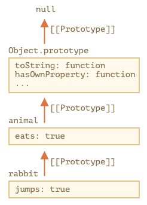

`hasOwnProperty` does not appear in `for...in` loop because it's not enumerable. All properites of `Object.protoype` have `enumerable: false` flag.

## **[F.prototype](https://javascript.info/function-prototype)**

New objects can be created with a constructor function, like `new F()`. `F.prototype` is an object, then the `new` operator uses it to set `[[Prototype]]` for the new object.

`F.prototype` means a regular property called `"prototype"` on `F`.

```js
let animal = {
  eats: true,
}

function Rabbit(name) {
  this.name = name
}

Rabbit.prototype = animal // "When a new Rabbit is created, assign its [[Prototype]] to animal".

let rabbit = new Rabbit("White Rabbit") //  rabbit.__proto__ == animal

alert(rabbit.eats) // true
```

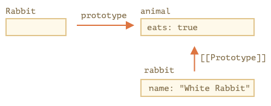

`"prototype"` is the horizonatal arrow, meaning a regular property, and `[[Prototype]]`is vertical, meaning the inheritance of `rabbit` and `animal`.

#### **`F.prototype` only used at `new F` time**

`F.prototype` property is only used when `new F` is called, it assigns `[[Prototype]]` of the new object.

If, after the creation, `F.prototype` property changes (`F.prototype` = `<another object>`), then new objects created by `new F` will have another object as `[[Prototype]]`, but already existing objects keep the old one.

### **Default F.prototype, constructor property**

Every fn has the `"prototype"` property even if it's not supplied. The default `"prototype"` is an ojbect with the only property `constructor` that points back to the fn itself.

```js
function Rabbit() {}

/* default prototype
Rabbit.prototype = { constructor: Rabbit };
*/

alert(Rabbit.prototype.constructor == Rabbit) // true
```

If we do nothing, the `constructor` is available through all subsequent rabbits

```jsfunction Rabbit() {}
// by default:
// Rabbit.prototype = { constructor: Rabbit }

let rabbit = new Rabbit(); // inherits from {constructor: Rabbit}

alert(rabbit.constructor == Rabbit); // true (from prototype)
```

```js
function Rabbit(name) {
  this.name = name
  alert(name)
}

let rabbit = new Rabbit("White Rabbit")

let rabbit2 = new rabbit.constructor("Black Rabbit")
```

The above is handy when we have an object, don't know which constrcutor was used for it (e.g. came from 3rd party lib), and we need to create another one of the same kind.

**Javascript does not ensure the right `"constructor"` value**

Default `"prototype"` exists for fns, but we can replace the default prototype as a whole, then there will be no `"constructor"` in it.

```js
function Rabbit() {}
Rabbit.prototype = {
  jumps: true,
}

let rabbit = new Rabbit()
alert(rabbit.constructor === Rabbit) // false
```

To keep the right `"constructor"` we can choose to add/remove properties to default `"prototype"`

```js
function Rabbit() {}

// Not overwrite Rabbit.prototype totally
// just add to it
Rabbit.prototype.jumps = true
// the default Rabbit.prototype.constructor is preserved

// or
Rabbit.prototype = {
  jumps: true,
  constructor: Rabbit,
}

// no constructor is also correct, b/c we added it
```

## **[Native prototypes](https://javascript.info/native-prototypes)**

### **Object.prototype**

```js
let obj = {} // obj = new Object()
alert(obj) // "[object Object]" ?
```

`Object` with it's own `prototype` referencing an object w/ `toString` and other methods. When `new Object()` is called (or `{...}`), the `[[Prototype]]` of it is set to `Object.prototype`.

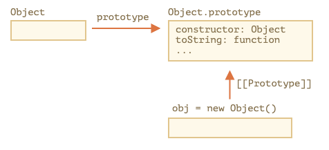

`obj.toString()` is called the method is taken from `Object.prototype`.

```jsx
let obj = {}

alert(obj.__proto__ === Object.prototype) // true

alert(obj.toString === obj.__proto__.toString) //true
alert(obj.toString === Object.prototype.toString) //true
```

### **Other built-in prototypes**

`Array`, `Date`, `Function`

When we create an array `[1,2,3]`, the default `new Array()` constructor is used internally. So `Array.prototype` becomes its prototype and provides methods.

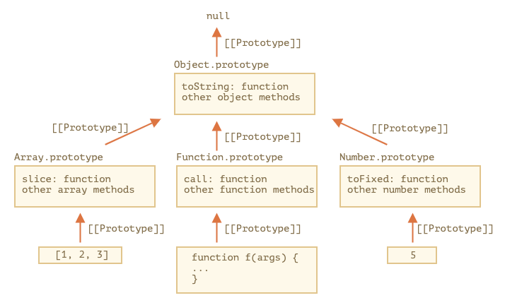

```js
let arr = [1, 2, 3]

// it inherits from Array.prototype?
alert(arr.__proto__ === Array.prototype) // true

// then from Object.prototype?
alert(arr.__proto__.__proto__ === Object.prototype) // true

// and null on the top.
alert(arr.__proto__.__proto__.__proto__) // null

alert(arr) // 1,2,3 <-- The result of Array.prototype.toString
```

`Object.prototype` has toString as well, but `Array.prototype` is closer in the chain, so the array variant is used.

### **Primitive**

Primitives such as string, numbers, and booleans have temporary wrapper objects when we try to access their properties (`String`, `Number`, and `Boolean`). `String.prototype`, `Number.prototype`, and `Boolean.prototype`.

### **Changing native prototypes**

Native prototypes can be modified. **In modern programming, there is only one case where modifying native prototypes is approved. Polyfilling.**

### **Borrowing from prototypes**

```js
let obj = {
  0: "Hello",
  1: "world!",
  length: 2,
}

obj.join = Array.prototype.join

alert(obj.join(",")) // Hello,world!
```

### **Borrowing from prototypes**

Take a method from one object and copy it into another. Some methods of native protoypes are often borrowed.

```js
let obj = {
  0: "Hello",
  1: "world!",
  length: 2,
}

obj.join = Array.prototype.join

alert(obj.join(",")) // Hello,world!
```

## **[Prototype methods, objects without **proto**](https://javascript.info/prototype-methods)**

Modern methods to create a prototype:

- [Object.create(proto, [descriptors])](https://developer.mozilla.org/en-US/docs/Web/JavaScript/Reference/Global_Objects/Object/create) – creates an empty object with given `proto` as `[[Prototype]]` and optional property descriptors.
- [Object.getPrototypeOf(obj)](https://developer.mozilla.org/en-US/docs/Web/JavaScript/Reference/Global_Objects/Object/getPrototypeOf) – returns the `[[Prototype]]` of `obj`.
- [Object.setPrototypeOf(obj, proto)](https://developer.mozilla.org/en-US/docs/Web/JavaScript/Reference/Global_Objects/Object/setPrototypeOf) – sets the `[[Prototype]]` of `obj` to proto.

```js
let animal = {
  eats: true,
}

// create a new object with animal as a prototype
let rabbit = Object.create(animal)

alert(rabbit.eats) // true

alert(Object.getPrototypeOf(rabbit) === animal) // true

Object.setPrototypeOf(rabbit, {}) // change the prototype of rabbit to {
```

`Object.create` has an optional second argument: property descriptors.

```js
let animal = {
  eats: true,
}

let rabbit = Object.create(animal, {
  jumps: {
    value: true,
  },
})

alert(rabbit.jumps) // true
```

### **Very plain objects**

```js
let obj = {}

let key = prompt("What's the key?", "__proto__")
obj[key] = "some value"

alert(obj[key]) // [object Object], not "some value"!
```

![obj [[Prototype]] points to Object.prototype](8-protoypes-inheritance/prototype-methods/obj-has-prototype.png)

```js
let obj = Object.create(null)

let key = prompt("What's the key?", "__proto__")
obj[key] = "some value"

alert(obj[key]) // "some value"
```

`Object.create(null)` creates an empty object w/o a prototype

![obj [[Prototype]] points to null](8-protoypes-inheritance/prototype-methods/obj-has-null.png)

## **[Error Handling](https://javascript.info/error-handling)**

### **[Try...catch](https://javascript.info/try-catch)**

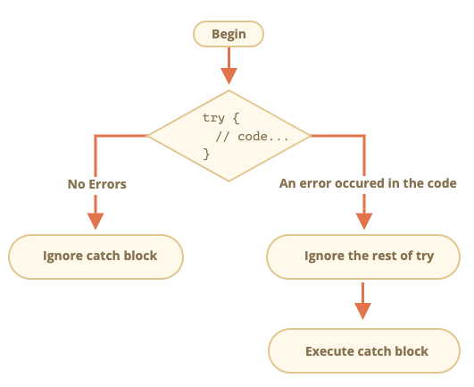

### **Error object**

```js
try {
  // ...
} catch (err) {
  // <-- the "error object", could use another word instead of err
  // ...
}
```

### **Optional "catch" binding**

If we don't need error details, `catch` may be omitted.

### **Error Object**

#### **`name`**

Error name. For instance, for an undefined variable that’s "ReferenceError".

#### **`message`**

Textual message about error details.
There are other non-standard properties available in most environments. One of most widely used and supported is:

#### **`stack`**

Current call stack: a string with information about the sequence of nested calls that led to the error. Used for debugging purposes.

### **"Throw" operator**

Built in constructors for standard errors: `Error`, `SyntaxError`, `ReferenceError`, `TypeError`

For built-in errors, the `name` property is the same name as the constructor. The `message` property is taken from the argument passed in the constructor.

Ex:

```js
let error = new Error("Things happen o_O")

alert(error.name) // Error
alert(error.message) // Things happen o_O
```

Example of throwing an error:

```js
let json = '{ "age": 30 }' // incomplete data

try {
  let user = JSON.parse(json) // <-- no errors

  if (!user.name) {
    throw new SyntaxError("Incomplete data: no name") // (*)
  }

  alert(user.name)
} catch (err) {
  alert("JSON Error: " + err.message) // JSON Error: Incomplete data: no name
}
```

### **Rethrowing**

**Catch should only process errors that it knows and “rethrow” all others.**

Rethrowing technique:

1. Catch gets all errors.
2. In the `catch (err) {...}` block we analyze the error object `err`.
3. If we don’t know how to handle it, we do `throw err`.

### **try…catch…finally**

`finally` block will always execute after a successful `try` block or after a `catch` block.

The `finally` clause works for any exit from `try...catch`. That includes an explicit `return`.

Ex:

```js
function func() {
  try {
    return 1
  } catch (err) {
    /* ... */
  } finally {
    alert("finally")
  }
}

alert(func()) // finally alerted first, then 1
```

### **Global Catch**

For a fatal error outside of `try...catch`.

```js
window.onerror = function (message, url, line, col, error) {
  // ...
}
```

| Parameter     | Description                                   |
| ------------- | --------------------------------------------- |
| `message`     | Error message.                                |
| `url`         | URL of the script where error happened.       |
| `line`, `col` | Line and column numbers where error happened. |
| `error`       | Error object.                                 |

The role of the global handler window.onerror is usually not to recover the script execution. There are also web-services that provide error-logging for such cases, like https://errorception.com or http://www.muscula.com.

They work like this:

1. We register at the service and get a piece of JS (or a script URL) from them to insert on pages.
2. That JS script sets a custom window.onerror function.
3. When an error occurs, it sends a network request about it to the service.
4. We can log in to the service web interface and see errors.

## **[Custom errors, extending Error](https://javascript.info/custom-errors)**

```

```
